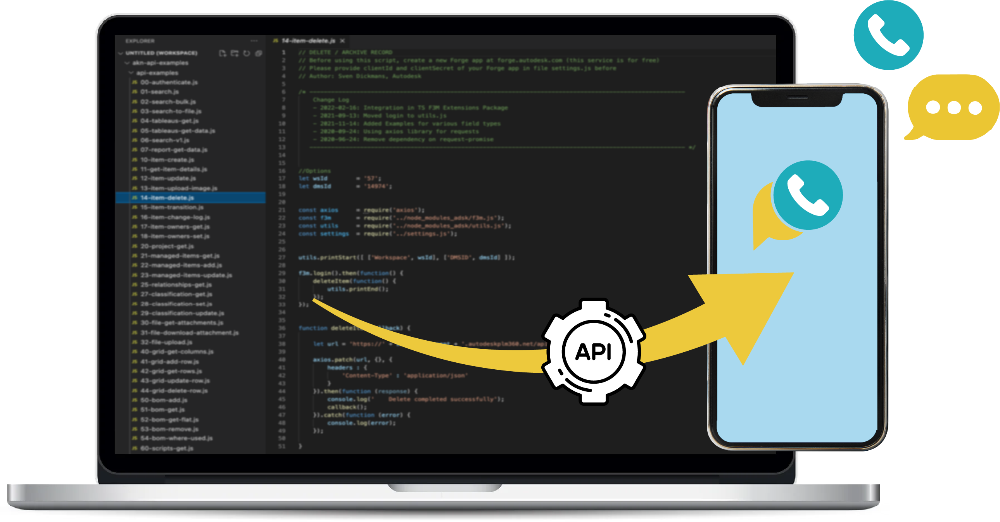

<p align="center">
  
</p>

<h1 align="center">inSIM API</h1>

<p align="center">
  <strong>Integrate your entire mobile telephony into your IT</strong>
</p>

<p align="center">
  <a href="https://www.ardary-insim.com">Website</a> •
  <a href="https://insim.app">Web App</a> •
  <a href="https://play.google.com/store/apps/details?id=com.wstechnologies.ardarysolo">Play Store</a> •
  <a href="#-quick-start">Quick Start</a>
</p>

<p align="center">
  
  
  
</p>

---

**inSIM** turns your smartphone into a professional communication gateway. Send and receive SMS, manage calls, and sync everything with your CRM/ERP through a simple REST API.

```
┌─────────────┐      ┌─────────────┐      ┌─────────────┐      ┌─────────────┐
│   Your IT   │ ←──→ │  inSIM API  │ ←──→ │  📱 Mobile  │ ←──→ │  Customers  │
│  CRM / ERP  │      │  Webhooks   │      │     App     │      │  Prospects  │
└─────────────┘      └─────────────┘      └─────────────┘      └─────────────┘
```

---

## 🎯 Why inSIM?

| Problem | inSIM Solution |
|---------|----------------|
| Mobile telephony isolated from IT | Your mobile number becomes an integrated channel |
| No record of SMS exchanges | Everything is synced and logged |
| Can't qualify calls | Annotations from mobile or webapp → webhook to CRM |
| No SMS campaign tracking | Click tracking and delivery status built-in |

### ✨ Key Benefits

- **🔄 Bidirectional** — Send AND receive SMS/calls with real-time webhooks
- **📱 Your Number** — Use your own mobile number, not an anonymous short code
- **🖥️ Multi-interface** — REST API + Conversational webapp + Mobile app
- **📊 Built-in Tracking** — Short links, click tracking, delivery reports (DLR)
- **📝 Call Qualification** — Annotate your calls and sync with your CRM

---

## 💼 Use Cases

- **Transactional Notifications** — Appointment confirmations, delivery updates, reminders
- **Sales Outreach** — SMS campaigns with click tracking
- **Customer Support** — SMS conversations from the webapp or your CRM
- **CRM Integration** — Automatically synced call qualifications

---

## 🚀 Quick Start

Send your first SMS in one request:

```bash
curl -X POST https://www.insim.app/api/v1/sendsms \
  -H "Content-Type: application/json" \
  -d '{
    "header": {
      "login": "user@email.com",
      "accessKey": "your-access-key"
    },
    "messages": [{
      "phone_number": "+33612345678",
      "message": "Hello from inSIM API!"
    }]
  }'
```

**Response:**
```json
{
  "id_sms_api": "FI5O7apqaaqcUmQ",
  "sms_per_message": 1,
  "phone_number": "+33612345678",
  "sent": 1
}
```

✅ **That's it.** Your SMS is sent from your own mobile number.

---

## 📋 Features

| Feature | API | Webhook | Description |
|---------|:---:|:-------:|-------------|
| Send SMS | ✅ | | Single or bulk, scheduled or immediate |
| Receive SMS | | ✅ | Real-time notification of incoming SMS |
| Click-to-Call | ✅ | | Trigger a call from your IT system |
| Delivery Status (DLR) | | ✅ | Know if the SMS was delivered |
| Click Tracking | | ✅ | Track who clicks your links |
| Call Events | | ✅ | Incoming, outgoing, missed |
| Call Qualification | | ✅ | Notes synced from mobile or webapp |
| Contact Management | ✅ | | Add contacts to your address book |

---

## 📡 API Endpoints

### Base URL
```
https://www.insim.app/api/v1
```

### Authentication

All requests require an authentication header:

```json
{
  "header": {
    "login": "user@email.com",
    "accessKey": "your-access-key"
  }
}
```

---

### 📤 Send SMS — `POST /sendsms`

```bash
curl -X POST https://www.insim.app/api/v1/sendsms \
  -H "Content-Type: application/json" \
  -d '{
    "header": {
      "login": "user@email.com",
      "accessKey": "your-access-key"
    },
    "messages": [
      {
        "phone_number": "+33612345678",
        "message": "Hi! Confirm your appointment here: [Lien_Tracking]",
        "url": "https://example.com/confirm",
        "priorite": 1,
        "date_to_send": "2025-10-29 10:00:00"
      }
    ]
  }'
```

#### Message Parameters

| Parameter | Type | Required | Description |
|-----------|------|----------|-------------|
| `phone_number` | String | ✅ | Phone number in international format (`+33612345678`) |
| `message` | String | ✅ | SMS content. Use `[Lien_Tracking]` to insert the tracked URL |
| `url` | String | | URL to track (will replace `[Lien_Tracking]`) |
| `priorite` | Number | | Priority: 0 (low), 1 (normal), 2 (high) |
| `date_to_send` | String | | Scheduled send date `"YYYY-MM-DD HH:mm:ss"` |

#### Response

```json
[
  {
    "id_sms_api": "FI5O7apqaaqcUmQ",
    "sms_per_message": 1,
    "user": "user@email.com",
    "sent_time": "2025-10-29T10:00:00.000Z",
    "phone_number": "+33612345678",
    "message": "Hi! Confirm your appointment here: https://arsms.co/xyz123",
    "sent": 1
  }
]
```

| Field | Description |
|-------|-------------|
| `id_sms_api` | Unique SMS identifier |
| `sms_per_message` | Number of SMS required (> 160 chars = multiple SMS) |
| `sent` | Status: 1 = sent, 0 = failed |

---

### 👥 Add Contacts — `POST /contact`

```bash
curl -X POST https://www.insim.app/api/v1/contact \
  -H "Content-Type: application/json" \
  -d '{
    "header": {
      "login": "user@email.com",
      "accessKey": "your-access-key"
    },
    "contacts": [
      {
        "firstname": "John",
        "lastname": "Doe",
        "phone_number": "+33612345678",
        "email": "john.doe@example.com",
        "adress": "123 Main Street"
      }
    ]
  }'
```

#### Response (Success)

```json
{
  "data": {
    "contact": [
      {
        "firstname": "John",
        "lastname": "Doe",
        "phonenumber": "+33612345678",
        "result": "success"
      }
    ]
  }
}
```

#### Error Codes

| Code | Description |
|------|-------------|
| `#001` | Invalid phone number |
| `#002` | Empty phone number |
| `#003` | phone_number variable not found |
| `#004` | Invalid email (warning, doesn't block creation) |

---

### 📞 Click-to-Call — `POST /clicTocall`

Trigger a call from your mobile phone connected to inSIM.

```bash
curl -X POST https://www.insim.app/api/v1/clicTocall \
  -H "Content-Type: application/json" \
  -d '{
    "header": {
      "login": "user@email.com",
      "accessKey": "your-access-key",
      "type": "clicToCall",
      "phone_number": "+33612345678"
    }
  }'
```

#### Response

```json
[
  {
    "info": "please make sure the phone is connected and inSIM is running",
    "result": "success",
    "errors": []
  }
]
```

#### Error Codes

| Code | Description |
|------|-------------|
| `#001` | Servers unavailable |
| `#002` | Phone not connected or inSIM not running |

---

## 🔔 Webhooks

inSIM sends real-time webhooks to your configured callback URLs.

### Configuration

- **HTTP Method**: GET
- **Encoding**: JSON data is encoded via `encodeURIComponent()`
- **URL Format**: `https://your-callback.com?{param}={encoded_json}`

### Summary Table

| Event | GET Parameter | Trigger |
|-------|---------------|---------|
| SMS Received | `message` | An SMS arrives on your mobile |
| Call Event | `calls` | Incoming, outgoing, or missed call |
| Delivery Status | `status` | SMS sent or received by recipient |
| Link Click | `clics` | Someone clicks your tracked link |
| Call Qualification | `qualification` | Note added from mobile or webapp |

---

### A. SMS Received — `incoming_sms`

```json
{
  "device_identification": "user@email.com",
  "title": "incoming_sms",
  "from": "+33612345678",
  "message": "Hi, I confirm my appointment",
  "date": "2025-01-15T14:30:00.000Z"
}
```

**URL called**: `https://your-callback.com?message={encoded_json}`

---

### B. Call Events — `incoming_call` / `outgoing_call` / `missed_call`

```json
{
  "device_identification": "user@email.com",
  "title": "incoming_call",
  "phone_number": "+33612345678",
  "call_time": "2025-01-15 14:30:00",
  "duration": "00:05:23"
}
```

| `title` Value | Description |
|---------------|-------------|
| `incoming_call` | Incoming call received |
| `outgoing_call` | Outgoing call made |
| `missed_call` | Missed call (duration = "0") |

**URL called**: `https://your-callback.com?calls={encoded_json}`

---

### C. Delivery Status (DLR) — `sent` / `received`

```json
{
  "user": "user@email.com",
  "phone_number": "+33612345678",
  "status": "received",
  "date_status": "2025-01-15T14:30:00.000Z",
  "id_sms_api": "FI5O7apqaaqcUmQ"
}
```

| `status` Value | Description |
|----------------|-------------|
| `sent` | SMS sent by the system |
| `received` | SMS received by the recipient |

**URL called**: `https://your-callback.com?status={encoded_json}`

---

### D. Click Tracking — `clicked_link`

```json
{
  "id_sms_api": "FI5O7apqaaqcUmQ",
  "clicked_link": "clicked_link",
  "phone_number": "+33612345678",
  "link": "https://example.com/confirm",
  "date": "2025-01-15 14:35:00"
}
```

**URL called**: `https://your-callback.com?clics={encoded_json}`

---

### E. Call Qualification

```json
{
  "device_identification": "user@email.com",
  "title": "call_qualification_from_mobile",
  "from": "+33612345678",
  "date": "2025-01-15 14:40:00",
  "qualification": "Interested customer - callback next week"
}
```

| `title` Value | Source |
|---------------|--------|
| `call_qualification_from_mobile` | From the mobile app |
| `call_qualification_from_interface` | From the webapp |

**URL called**: `https://your-callback.com?qualification={encoded_json}`

---

## 💻 Implementation Examples

### Python — Send SMS

```python
import requests

response = requests.post(
    "https://www.insim.app/api/v1/sendsms",
    json={
        "header": {
            "login": "user@email.com",
            "accessKey": "your-access-key"
        },
        "messages": [{
            "phone_number": "+33612345678",
            "message": "Test from Python"
        }]
    }
)
print(response.json())
```

### Python (Flask) — Receive Webhooks

```python
from flask import Flask, request
import json
from urllib.parse import unquote

app = Flask(__name__)

@app.route('/webhook', methods=['GET'])
def webhook():
    if 'message' in request.args:
        sms = json.loads(unquote(request.args['message']))
        print(f"SMS from {sms['from']}: {sms['message']}")
    
    if 'status' in request.args:
        dlr = json.loads(unquote(request.args['status']))
        print(f"SMS {dlr['id_sms_api']} → {dlr['status']}")
    
    if 'clics' in request.args:
        click = json.loads(unquote(request.args['clics']))
        print(f"Click from {click['phone_number']} on {click['link']}")
    
    if 'calls' in request.args:
        call = json.loads(unquote(request.args['calls']))
        print(f"{call['title']} — {call['phone_number']}")
    
    if 'qualification' in request.args:
        qual = json.loads(unquote(request.args['qualification']))
        print(f"Qualification: {qual['qualification']}")
    
    return 'OK', 200

if __name__ == '__main__':
    app.run(port=3000)
```

### PHP — Send SMS

```php
<?php
$response = file_get_contents(
    'https://www.insim.app/api/v1/sendsms',
    false,
    stream_context_create([
        'http' => [
            'method' => 'POST',
            'header' => 'Content-Type: application/json',
            'content' => json_encode([
                'header' => [
                    'login' => 'user@email.com',
                    'accessKey' => 'your-access-key'
                ],
                'messages' => [[
                    'phone_number' => '+33612345678',
                    'message' => 'Test from PHP'
                ]]
            ])
        ]
    ])
);
echo $response;
```

### PHP — Receive Webhooks

```php
<?php
if (isset($_GET['message'])) {
    $sms = json_decode($_GET['message'], true);
    // Process incoming SMS
}

if (isset($_GET['status'])) {
    $dlr = json_decode($_GET['status'], true);
    // Update delivery status
}

if (isset($_GET['clics'])) {
    $click = json_decode($_GET['clics'], true);
    // Record the click
}

if (isset($_GET['calls'])) {
    $call = json_decode($_GET['calls'], true);
    // Log the call
}

if (isset($_GET['qualification'])) {
    $qual = json_decode($_GET['qualification'], true);
    // Sync with CRM
}

http_response_code(200);
echo 'OK';
```

### Node.js (Express) — Receive Webhooks

```javascript
const express = require('express');
const app = express();

app.get('/webhook', (req, res) => {
  if (req.query.message) {
    const sms = JSON.parse(decodeURIComponent(req.query.message));
    console.log(`SMS from ${sms.from}: ${sms.message}`);
  }
  
  if (req.query.status) {
    const dlr = JSON.parse(decodeURIComponent(req.query.status));
    console.log(`SMS ${dlr.id_sms_api} → ${dlr.status}`);
  }
  
  if (req.query.clics) {
    const click = JSON.parse(decodeURIComponent(req.query.clics));
    console.log(`Click: ${click.phone_number} → ${click.link}`);
  }
  
  if (req.query.calls) {
    const call = JSON.parse(decodeURIComponent(req.query.calls));
    console.log(`${call.title}: ${call.phone_number}`);
  }
  
  if (req.query.qualification) {
    const qual = JSON.parse(decodeURIComponent(req.query.qualification));
    console.log(`Qualification: ${qual.qualification}`);
  }
  
  res.status(200).send('OK');
});

app.listen(3000);
```

---

## 🏁 Getting Started

### Prerequisites

1. **Create an account** on [ardary-insim.com](https://www.ardary-insim.com)
2. **Install the mobile app** from the [Play Store](https://play.google.com/store/apps/details?id=com.wstechnologies.ardarysolo) *(iOS coming soon)*
3. **Connect your mobile** to inSIM via the app
4. **Get your credentials** (login + accessKey) from your dashboard

### First API Call

```bash
# Test your connection by sending an SMS to yourself
curl -X POST https://www.insim.app/api/v1/sendsms \
  -H "Content-Type: application/json" \
  -d '{
    "header": {
      "login": "user@email.com",
      "accessKey": "YOUR_ACCESS_KEY"
    },
    "messages": [{
      "phone_number": "YOUR_NUMBER",
      "message": "inSIM API test ✅"
    }]
  }'
```

---

## 📝 Technical Notes

- **Phone number format**: Always use international format with `+` (e.g., `+33612345678`)
- **Date format**: `"YYYY-MM-DD HH:mm:ss"` for `date_to_send`
- **Tracked link**: Use `[Lien_Tracking]` in the message, it will be replaced by the short URL
- **Webhooks**: Respond with a `200 OK` status quickly (< 5 seconds)
- **HTTPS**: Always use HTTPS for your callback URLs

---

## 🔗 Links & Resources

| Resource | Link |
|----------|------|
| 🌐 Official Website | [ardary-insim.com](https://www.ardary-insim.com) |
| 💬 Web App | [insim.app](https://insim.app) |
| 📱 Play Store | [Download](https://play.google.com/store/apps/details?id=com.wstechnologies.ardarysolo) |
| 🍎 App Store | *Coming soon* |
| 📦 Node.js SDK | [insim-node](https://github.com/ArdaryinSIM/insim-node) |
| 📦 PHP SDK | [insim-php-composer](https://github.com/ArdaryinSIM/insim-php-composer) |

---

## 🆘 Support

For any questions or assistance:
- 📧 Contact us via [ardary-insim.com](https://www.ardary-insim.com)
- 🏢 **Reach Technologies** — France

---

## 📄 License

MIT © [Reach Technologies](https://www.ardary-insim.com)
